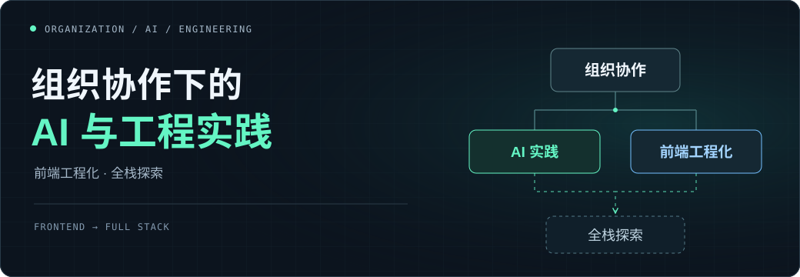

<b>你好，我是 Ray。</b>一名前端负责人，关注工程质量、团队成长，以及 AI 如何进入真实的研发协作。

这里记录我的项目实践、管理方法和学习过程。希望每一次尝试，都能留下可以继续使用的代码、工具或经验。

  <a href="https://github.com/leidaibo-lab/frontend-leadership">前端负责人手册 ↗</a> &nbsp; · &nbsp;
  <a href="https://github.com/leidaibo-lab/ai-platform">AI 应用实践 ↗</a> &nbsp; · &nbsp;
  <a href="https://github.com/leidaibo-lab?tab=repositories">全部仓库 ↗</a>

<h2>精选项目 Selected work</h2>

<table>
  <tr>
    <td width="50%" valign="top">
      
<code>01 / LEADERSHIP</code>

      <h3><a href="https://github.com/leidaibo-lab/frontend-leadership">Frontend Leadership ↗</a></h3>
      
前端负责人实战手册与 AI Skills。从职级评审、1v1 到团队治理，提供可以开始使用的模板与案例。

      
团队管理 · 成长证据 · AI 研发协作

    </td>
    <td width="50%" valign="top">
      
<code>02 / AI ENGINEERING</code>

      <h3><a href="https://github.com/leidaibo-lab/ai-platform">AI Platform ↗</a></h3>
      
从真实业务场景出发，探索 AI 应用的端到端链路，积累可验证、可复用的工程能力。

      
业务场景 · 应用工程 · 验证与治理

    </td>
  </tr>
  <tr>
    <td width="50%" valign="top">
      
<code>03 / SYSTEM THINKING</code>

      <h3><a href="https://github.com/leidaibo-lab/backend-system-thinking">Backend System Thinking ↗</a></h3>
      
面向前端与非后端工程师的 12 讲后端架构课程。通过订单系统理解请求、事务、分布式与可靠性。

      
系统设计 · 架构认知 · 工程学习

    </td>
    <td width="50%" valign="top">
      
<code>04 / PRODUCT PRACTICE</code>

      <h3><a href="https://github.com/leidaibo-lab/pm-hrm">PM · HRM ↗</a></h3>
      
借助 AI 推进人资系统的产品发现、需求澄清与交付验证。当前聚焦招聘管理 MVP。

      
产品探索 · PRD · 交付验证

    </td>
  </tr>
</table>

<h2>近期记录 Field notes</h2>

<ul>
  <li><a href="https://github.com/leidaibo-lab/frontend-leadership/blob/main/.agents/skills/frontend-leadership/tech-efficiency-architect/references/ai-coding-evolution.md"><b>AI Coding 跃迁</b></a> — 用四张图梳理工程化、产研协作与 Skills 规划。</li>
  <li><a href="https://github.com/leidaibo-lab/frontend-leadership/blob/main/.agents/skills/frontend-leadership/tech-efficiency-architect/references/ai-organization-operating-model-sharing.md"><b>AI 驱动组织运行模式升级讨论</b></a> — 一次公司内部分享，以及三个待验证的试点方向。</li>
  <li><a href="https://github.com/leidaibo-lab/nest-learning-lab"><b>Nest Learning Lab</b></a> — 通过 Fastify、TypeScript 和业务示例继续学习后端工程。</li>
</ul>

<!-- Animation: https://github.com/Platane/snk -->
<picture>
  <source media="(prefers-color-scheme: dark)" srcset="./assets/contribution-snake-dark.svg" />
  <source media="(prefers-color-scheme: light)" srcset="./assets/contribution-snake.svg" />
  
</picture>
